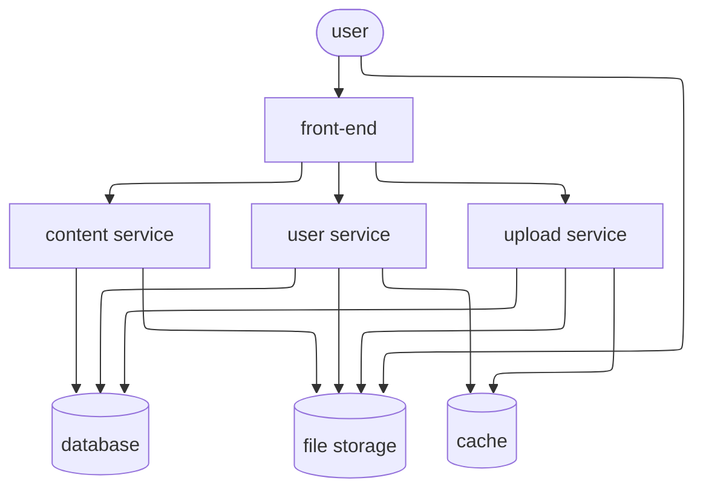

# WeAllTube

**_WeAllTube_** is a video hosting and streaming service.
This repository contains a quick React demo of the web app's front page.
You can see the demo at https://aghz.github.io/wealltube-web/
(with apologies for the lack of loading indicator).

## Codebase

The codebase is a simple React app managed with [Vite](https://vitejs.dev/).
I chose Vite over Next.js because I wanted a pure front-end bundle that I could
deploy to GitHub pages. It's also optimized for a quick developer experience out
of the box which was useful for this hackathon-style project.

For the demo, the app is making calls to [Pexels](https://www.pexels.com/search/videos/nature/?orientation=landscape),
a site for royalty-free images and videos with a good API. Ideally I would have
liked to abstract away the API so that it can be replaced with any implementation
using React context providers.

I used Redux for managing the API call results. It's too heavy for this demo,
but the site would concievably grow to require additional state and Redux would
be perfect for that. I decided to try [Redux Toolkit](https://redux-toolkit.js.org/)
but I had no prior experience with it and learning it on the fly set me back a bit.
I would've liked to spend more time digging into RTK Query and to use entity
adapters, they seem like solid tools for managing API calls. I was running
low on time though, so I limited myself to async thunks which are modelled on
redux-thunk, with which I was already familiar.

I used TailwindCSS for managing style in React. It's a controversial option,
and it was also my first attempt at using it, but it comes highly
recommended by well-established teams. I would have liked to use it to its
full potential by making the app responsive and add a dark mode but styling
wasn't high enough on the priority list. It can also get cumbersome to use
without a helper lib, which I didn't have time to investigate.

Other things I wanted to add but had to skip due to time constraints are
* loading indicators for the style assets as well as the API calls
* pagination with infinite scroll, turns out it's a bit tricky via Redux
  ([some approaches in this discussion](https://github.com/reduxjs/redux-toolkit/discussions/1163))
* routing with a simple video page
* a simple video player that would record playback position in the Redux state.
* at least some minimal tests

## System architecture

### Diagram

(The Mermaid diagram didn't turn out looking as good as I'd hoped,
I thought it would be great to have it rendered straight in GitHub but
now I regret the choice)

### Description

The system I'm proposing uses essentially a service-oriented architecture
with a shared front-end, database and cache.

Distributing the front-end as an SPA allows us to leverage CDNs for faster
transfer. If business metrics require it, this could be transitioned to
server-side rendering for potential improvements to SEO and user experience.

I chose to split the architecture into three services:
* The content service deals with keeping track of video inventory
* The user service manages user accounts
* The upload service manages new videos uploaded by users

Users access content straight from file storage. They also upload their videos
straight to storage, adding any infrastructure in-between introduces unnecessary
load and bandwidth.

Once the file is uploaded to storage, the upload service processes it for
transcoding, thumbnail extraction, subtitles, etc. Infrastructure providers
usually also offer dedicated services for these tasks. The upload service makes
use of the cache to keep track of progress.

The user management service handles user signup, authentication, preferences
(including profile pictures for which it uses the file storage). It also
correlates users to the videos they upload, to playlists they create, and
to watching progress (for which it uses the cache service, possibly persisted
periodically to the DB).

The content service simply keeps track of videos that are available, along with
related metadata and file storage locations.

### Technology recommendations

I suggest PostgreSQL for the database, or an equivalent relational database.
The data model is highly relational, correlating users, videos, playlists and
related metadata. It would be cumbersome to ensure consistency using a
non-relational approach (but not impossible, e.g. Mongoose can mimick something
like a relational database on top of MongoDB, but I'm not aware of any real advantage).

For the cache, Redis is a de-facto standard.

For the codebase, I recommend Typescript for both the front-end and the back-end.
There are real gains from having both sides of the stack written in the same language.
Performance-wise, I believe Node.js is at least on par with or even exceeding
comparable alternatives like Python or Ruby. Additionally, the type safety provided
by Typescript on top of Javascript allows the team to more confidently mix
various levels of expertise while keeping the evolution of the codebase manageable.

For frameworks, I recommend React for the active community around it, which ensures
that the code is well battle-tested and that solutions are readily available
for common problems. For the back-end, I recommend NestJS as a more structured
approach to using Express, it's been my experience that Node.js APIs evolve
rather messily without strong opinions that are well enforced.
